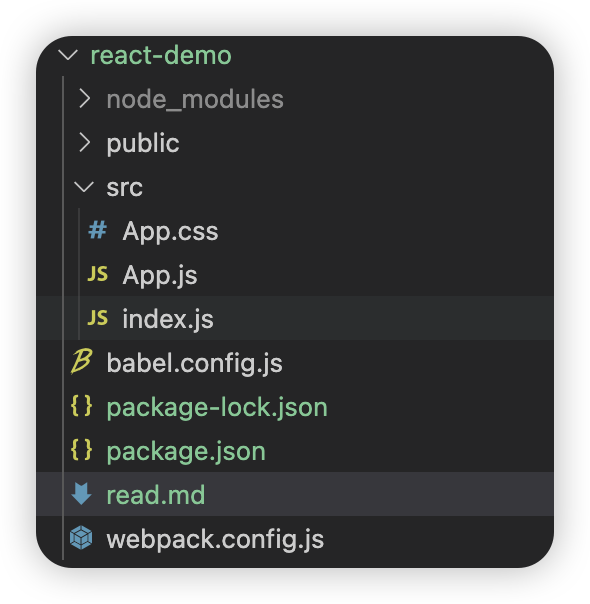

# 使用webapck 从零创建  react 工程

## 1、首先使用 npm init 创建一个前端项目
```shell
mkdir my-app
cd my-app
npm init -y
```
## 2、安装 webpack
```shell
npm i -D webpack webpack-cli webpack-dev-server html-webpack-plugin
```
webpack - 前端构建工具
webpack-cli - 让 webpack 支持命令行执行
webpack-dev-server - 开发模式下启动服务器，修改代码，浏览器会自动刷新。


## 3、 安装 babel
babel： 可以将 es6 代码转变为 es5，
@babel/preset-react： 让 babel 支持 react 的预设
babel-loader：是让 webpack 支持 babel 的加载器
```javascript
npm i -D @babel/core @babel/preset-env @babel/preset-react babel-loader
```
在项目更目录新建一个 `babel.config.js` 文件，将安装的 babel 写入这个文件，babel 会在运行前读取这份配置文件

babel.config.js
```javascript
module.exports = {
  presets: ['@babel/preset-env', '@babel/preset-react'],
}

```

## 安装 CSS 加载器
```shell
npm i -D style-loader css-loader
```
css-loader 用于解析 css 文件； `style-loader` 会通过使用多个 `<style></style>`标签的形式自动把 styles 插入到 DOM 中。

## 安装 react 和 react-dom
```shell
npm i react react-dom
```
## 新建文件
建一个 `index.html` 文件
创建一个在public目录，并且在下面新建一个index.html 文件。

新建一个 `index.js` 文件
创建一个名为 src 的文件夹，所有源代码都放在该目录下，在src目录下，创建index.js文件，该文件也就是 webpack 构建的入口文件
创建文件

 `src/index.js`: webpack 构建的入口文件
 ```js
 import React from 'react'
import ReactDOM from 'react-dom/client'
import App from './App'
const root = ReactDOM.createRoot(document.getElementById('root'));

console.log(React);

root.render(
    <React.StrictMode>
      <App />
    </React.StrictMode>
  );
```
 `src/App.js`  组件
  ```js
  import React from 'react'
import './App.css'
function App() {
    return (
        <div>
            <header>
                头
            </header>
            <p>内容</p>
            <footer>脚</footer>
        </div>
    )
}
export default App
```
 在项目根目录创建一个 `webpack.config.js` 文件，   `webpack.config.js` 是 webpack 的默认配置文件名

 

 文件webpack.config.js：
 ```javascript
 const path = require('path')
const HtmlWebpackPlugin = require('html-webpack-plugin')

module.exports = {
    entry: './src/index.js',
    output: {
        path: path.join(__dirname, '/dist'),
        filename: 'bundle.js',
        clean: true
    },
    devtool: 'source-map',
    module: {
        rules: [
            {
                test: /\.js$/,
                exclude: /node_modules/,
                use: {
                    loader: 'babel-loader',
                }
            },
            {
                test: /\.css$/i,
                use: ['style-loader', 'css-loader'],
              },
        ]
    },
    plugins: [
        new HtmlWebpackPlugin({
            template: './public/index.html'
        })
    ],
    devServer: {
        proxy: [
            {
                context: ['/auth', '/api'],
                target: 'http://localhost:3000'
            }
        ]
    }
}
 ```

package.json
 ```json
 {
  "name": "react-demo",
  "version": "1.0.0",
  "main": "index.js",
  "scripts": {
    "test": "echo \"Error: no test specified\" && exit 1",
    "start": "webpack-dev-server --mode development --hot --open",
    "build": "webpack --mode production"
  },
  "keywords": [],
  "author": "",
  "license": "ISC",
  "description": "",
  "devDependencies": {
    "@babel/core": "^7.26.0",
    "@babel/preset-env": "^7.26.0",
    "@babel/preset-react": "^7.25.9",
    "babel-loader": "^9.2.1",
    "css-loader": "^7.1.2",
    "html-webpack-plugin": "^5.6.3",
    "style-loader": "^4.0.0",
    "webpack": "^5.95.0",
    "webpack-cli": "^5.1.4",
    "webpack-dev-server": "^5.1.0"
  },
  "dependencies": {
    "react": "^18.3.1",
    "react-dom": "^18.3.1"
  }
}

 ```